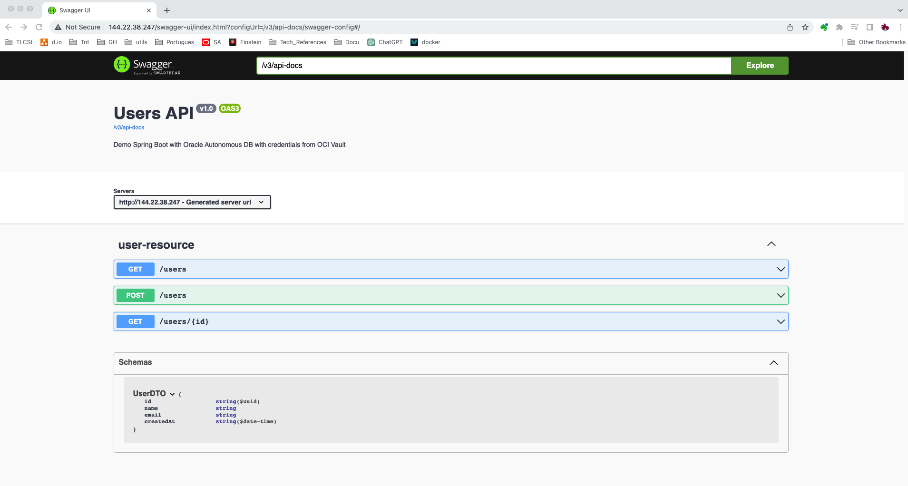

# hello-autonomousdb

# What is Hello Autonomous DB project?
The demo shows how you can integrate a spring-boot cloud native application with Oracle autonomous DB.
You will be able to run this application from Your IDE or you can deploy it in Oracle Cloud Infrastructure.

# Protecting your database credentials with OCI Vault 

OCI Vault is a Centralized and customer controlled key management.
It is: 
- natively integrated to many OCI services – Autonomous, Exadata, Object Storage and others
- Fully managed
- highly available service
- Support regulatory compliance: Meets PCI DSS and FIPS 140-2 Level 3 standard for cryptographic processing

Hardcoding the database credentials in the configuration files might be acceptable for less critical environements like local developer station.
On the other hand, using a Secret Manager is number 1 security best practice for protecting any sensitive information (example, DB credentials for a production environment):
- Store and retrieve any sensitive information
- Encrypted using keys from Vault

Using Secret management in OCI Vault, is completely free. 
We will see it's easy to integrate with spring-boot application using oci-sdk.

# Running the application in your I.D.E

## Pre-requisites
An autonomous Database should be already Provisioned on Oracle cloud.
## Application configuration
Simply replace the following properties with your own configuration:
## Application execution
Launch the application, using the class: HelloAutonomousdbApplication
Test the access to the application: http://localhost:8080/.


# Running the application in your Oracle Cloud Tenant
## Pre-requisites
- kubectl
- docker CLI
- Terraform 0.12.16+ is Installed
- OCI CLI Installed
- Create a compartments: `Test`
- maven 3

## Getting your tenant configuration
- You have setup the link:https://docs.cloud.oracle.com/iaas/Content/API/Concepts/apisigningkey.htm[required keys]
- You know the link:https://docs.cloud.oracle.com/iaas/Content/API/Concepts/apisigningkey.htm#five[required OCIDs]

## Building the application 

1. Execute script `./build-tag-release.sh` Arguments will be required as follow: 

`./build-tag-release.sh appname user region tenancy-hash`

`appname` must be the same name that's created as OCIR repo in OCI
`user` must be your OCI User which already has permissions to manage the OKE Cluster
`region`is the canonical name of the region where OCIR repo is
`tenancy-hash` is the Object Storage Namespace of your tenancy


Expected output

```shell
ubuntu@dalquintamd:~/REPOS/hello-autonomousdb/deployment/bash$ ./build-tag-release.sh samplespringboot oracleidentitycloudservice/denny.alquinta@oracle.com sa-santiago-1 idlhjo6dp3bd
Enter OCIR Token
YOUR_OCIR_TOKEN_GOES_HERE!
--- login into OCIR ---
WARNING! Your password will be stored unencrypted in /home/ubuntu/.docker/config.json.
Configure a credential helper to remove this warning. See
https://docs.docker.com/engine/reference/commandline/login/#credentials-store

Login Succeeded
--- pruning images ---
Total reclaimed space: 0B
--- building image samplespringboot:latest ---
Sending build context to Docker daemon  31.02MB
Step 1/13 : FROM eclipse-temurin:11.0.18_10-jdk
11.0.18_10-jdk: Pulling from library/eclipse-temurin
10ac4908093d: Pull complete 
c5b99dc26ba3: Pull complete 
a938f614c6ec: Pull complete 
9d29fbf918c4: Pull complete 
Digest: sha256:ab188c266f7b55f6f96c8e39ad28a5f9a6de21e7cfc272e66974ee91bf945bdb
Status: Downloaded newer image for eclipse-temurin:11.0.18_10-jdk
 ---> 6a7b3762b5db
Step 2/13 : WORKDIR /root/app
 ---> Running in 7a177d32a359
Removing intermediate container 7a177d32a359
 ---> 99f48d054d89
Step 3/13 : COPY . .
 ---> e69bb5b85d8a
Step 4/13 : RUN ./mvnw clean package ; echo ok
 ---> Running in 57895393d725
 ...
 ...
 ...
 Downloaded from central: https://repo.maven.apache.org/maven2/org/iq80/snappy/snappy/0.4/snappy-0.4.jar (58 kB at 460 kB/s)
Downloaded from central: https://repo.maven.apache.org/maven2/org/apache/maven/maven-compat/3.0/maven-compat-3.0.jar (285 kB at 1.7 MB/s)
Downloaded from central: https://repo.maven.apache.org/maven2/org/tukaani/xz/1.8/xz-1.8.jar (109 kB at 639 kB/s)
Downloaded from central: https://repo.maven.apache.org/maven2/org/codehaus/plexus/plexus-utils/3.3.0/plexus-utils-3.3.0.jar (263 kB at 1.4 MB/s)
Downloaded from central: https://repo.maven.apache.org/maven2/org/apache/commons/commons-compress/1.19/commons-compress-1.19.jar (615 kB at 3.1 MB/s)
[INFO] Building jar: /root/app/target/hello-autonomousdb-0.0.1-SNAPSHOT.jar
[INFO] 
[INFO] --- spring-boot-maven-plugin:2.4.5:repackage (repackage) @ hello-autonomousdb ---
[INFO] Replacing main artifact with repackaged archive
[INFO] 
[INFO] --- spring-boot-maven-plugin:2.4.5:repackage (default) @ hello-autonomousdb ---
[INFO] Replacing main artifact with repackaged archive
[INFO] ------------------------------------------------------------------------
[INFO] BUILD SUCCESS
[INFO] ------------------------------------------------------------------------
[INFO] Total time:  02:06 min
[INFO] Finished at: 2023-02-28T18:16:07Z
[INFO] ------------------------------------------------------------------------
ok
Removing intermediate container 57895393d725
 ---> 1e162bddfac5
Step 5/13 : RUN mkdir /root/.oci
 ---> Running in a562df7259b2
Removing intermediate container a562df7259b2
 ---> 46b085673ef2
Step 6/13 : RUN cd ./dependencies; ls -ltr;
 ---> Running in 41fe1b42d5ea
total 36
-rw-rw-r-- 1 root root 26482 Feb 28 17:04 wallet.zip
-rw------- 1 root root  1703 Feb 28 17:07 api
-rw------- 1 root root   284 Feb 28 17:08 config
Removing intermediate container 41fe1b42d5ea
 ---> 7162532465fb
Step 7/13 : RUN mv ./dependencies/* /root/.oci
 ---> Running in 77c2219c86ed
Removing intermediate container 77c2219c86ed
 ---> 9ae1fb7fd89d
Step 8/13 : RUN apt-get update && apt-get install -y unzip
 ---> Running in b6c1f2098b16
Get:1 http://security.ubuntu.com/ubuntu jammy-security InRelease [110 kB]
Get:2 http://archive.ubuntu.com/ubuntu jammy InRelease [270 kB]
Get:3 http://security.ubuntu.com/ubuntu jammy-security/restricted amd64 Packages [752 kB]
Get:4 http://archive.ubuntu.com/ubuntu jammy-updates InRelease [119 kB]
Get:5 http://archive.ubuntu.com/ubuntu jammy-backports InRelease [107 kB]
Get:6 http://security.ubuntu.com/ubuntu jammy-security/multiverse amd64 Packages [5,557 B]
Get:7 http://security.ubuntu.com/ubuntu jammy-security/universe amd64 Packages [870 kB]
Get:8 http://archive.ubuntu.com/ubuntu jammy/restricted amd64 Packages [164 kB]
Get:9 http://archive.ubuntu.com/ubuntu jammy/universe amd64 Packages [17.5 MB]
Get:10 http://security.ubuntu.com/ubuntu jammy-security/main amd64 Packages [811 kB]
Get:11 http://archive.ubuntu.com/ubuntu jammy/main amd64 Packages [1,792 kB]
Get:12 http://archive.ubuntu.com/ubuntu jammy/multiverse amd64 Packages [266 kB]
Get:13 http://archive.ubuntu.com/ubuntu jammy-updates/multiverse amd64 Packages [10.9 kB]
Get:14 http://archive.ubuntu.com/ubuntu jammy-updates/restricted amd64 Packages [808 kB]
Get:15 http://archive.ubuntu.com/ubuntu jammy-updates/universe amd64 Packages [1,104 kB]
Get:16 http://archive.ubuntu.com/ubuntu jammy-updates/main amd64 Packages [1,137 kB]
Get:17 http://archive.ubuntu.com/ubuntu jammy-backports/universe amd64 Packages [22.4 kB]
Get:18 http://archive.ubuntu.com/ubuntu jammy-backports/main amd64 Packages [49.0 kB]
Fetched 25.9 MB in 4s (6,769 kB/s)
Reading package lists...
Reading package lists...
Building dependency tree...
Reading state information...
Suggested packages:
  zip
The following NEW packages will be installed:
  unzip
0 upgraded, 1 newly installed, 0 to remove and 10 not upgraded.
Need to get 174 kB of archives.
After this operation, 385 kB of additional disk space will be used.
Get:1 http://archive.ubuntu.com/ubuntu jammy-updates/main amd64 unzip amd64 6.0-26ubuntu3.1 [174 kB]
debconf: delaying package configuration, since apt-utils is not installed
Fetched 174 kB in 1s (161 kB/s)
Selecting previously unselected package unzip.
(Reading database ... 7651 files and directories currently installed.)
Preparing to unpack .../unzip_6.0-26ubuntu3.1_amd64.deb ...
Unpacking unzip (6.0-26ubuntu3.1) ...
Setting up unzip (6.0-26ubuntu3.1) ...
Removing intermediate container b6c1f2098b16
 ---> 3b2768b558ea
Step 9/13 : RUN unzip -d /root/.oci/wallet /root/.oci/wallet.zip
 ---> Running in bacb34209724
Archive:  /root/.oci/wallet.zip
  inflating: /root/.oci/wallet/ewallet.pem  
  inflating: /root/.oci/wallet/README  
  inflating: /root/.oci/wallet/cwallet.sso  
  inflating: /root/.oci/wallet/tnsnames.ora  
  inflating: /root/.oci/wallet/truststore.jks  
  inflating: /root/.oci/wallet/ojdbc.properties  
  inflating: /root/.oci/wallet/sqlnet.ora  
  inflating: /root/.oci/wallet/ewallet.p12  
  inflating: /root/.oci/wallet/keystore.jks  
Removing intermediate container bacb34209724
 ---> d04906c79ca4
Step 10/13 : ENV TNS_ADMIN=/root/oci/wallet
 ---> Running in ab31a65c11be
Removing intermediate container ab31a65c11be
 ---> 5dcd484987a2
Step 11/13 : RUN rm ./src/main/resources/application-hardcoded.yml && rm ./src/main/resources/application-local.yml;
 ---> Running in 0a415b3959c4
Removing intermediate container 0a415b3959c4
 ---> da161d5e58e3
Step 12/13 : EXPOSE 8080
 ---> Running in 44d01c141f27
Removing intermediate container 44d01c141f27
 ---> 2013207951e4
Step 13/13 : ENTRYPOINT ["bash", "-c", "java -jar target/hello-autonomousdb-0.0.1-SNAPSHOT.jar --spring.config.location=./src/main/resources/"]
 ---> Running in 711fd76d79b1
Removing intermediate container 711fd76d79b1
 ---> 9daed112a64a
Successfully built 9daed112a64a
Successfully tagged samplespringboot:latest
--- tag image samplespringboot:latest ---
--- push image samplespringboot:latest ---
The push refers to repository [sa-santiago-1.ocir.io/idlhjo6dp3bd/samplespringboot]
53c5c0c8f055: Pushed 
2397cc973328: Pushed 
df2f5b61fbf8: Pushed 
de05c193387d: Pushed 
9380bb656b19: Pushed 
81009a756c2a: Pushing [===========>                                       ]  49.22MB/216.3MB
9dab4a9bb5f7: Pushed 
7083fc4924a9: Pushed 
6f27936daf95: Layer already exists 
2a2545560d49: Layer already exists 
862320036867: Layer already exists 
c5ff2d88f679: Layer already exists 
latest: digest: sha256:b3fad8636cbf2c00cd578bc658a33b87234ef6d0007ad39efb0430cf8217a649 size: 2837
--- all set! ---
```

2. Run script `pre-requisites.sh` This will create in OKE the OCIR token required to pull the image from private repo, along with the corresponding namespace

3. Create Ingress Controller, by executing script `./deploy-ingress-controller.sh`

Expected output:

```shell
namespace/ingress-nginx created
serviceaccount/ingress-nginx created
serviceaccount/ingress-nginx-admission created
role.rbac.authorization.k8s.io/ingress-nginx created
role.rbac.authorization.k8s.io/ingress-nginx-admission created
clusterrole.rbac.authorization.k8s.io/ingress-nginx created
clusterrole.rbac.authorization.k8s.io/ingress-nginx-admission created
rolebinding.rbac.authorization.k8s.io/ingress-nginx created
rolebinding.rbac.authorization.k8s.io/ingress-nginx-admission created
clusterrolebinding.rbac.authorization.k8s.io/ingress-nginx created
clusterrolebinding.rbac.authorization.k8s.io/ingress-nginx-admission created
configmap/ingress-nginx-controller created
service/ingress-nginx-controller created
service/ingress-nginx-controller-admission created
deployment.apps/ingress-nginx-controller configured
job.batch/ingress-nginx-admission-create created
job.batch/ingress-nginx-admission-patch created
ingressclass.networking.k8s.io/nginx created
validatingwebhookconfiguration.admissionregistration.k8s.io/ingress-nginx-admission configured

```
**NOTE** 
If required, update the following annotation on yaml, to create either the Ingress Controller on a public or private subnet: 

```yaml
apiVersion: v1
kind: Service
metadata:
  labels:
    app.kubernetes.io/component: controller
    app.kubernetes.io/instance: ingress-nginx
    app.kubernetes.io/name: ingress-nginx
    app.kubernetes.io/part-of: ingress-nginx
    app.kubernetes.io/version: 1.2.0
  name: ingress-nginx-controller
  namespace: ingress-nginx
  annotations:
    service.beta.kubernetes.io/oci-load-balancer-shape: "flexible"
    service.beta.kubernetes.io/oci-load-balancer-shape-flex-min: "10"
    service.beta.kubernetes.io/oci-load-balancer-shape-flex-max: "100"
    service.beta.kubernetes.io/oci-load-balancer-internal: "true"  <THIS SHOULD BE FALSE IN CASE YOU GO WITH A PUBLIC LBaaS> 
spec:
  externalTrafficPolicy: Local
  ports:
  - appProtocol: http
    name: http
    port: 80
    protocol: TCP
```

3. Deploy the application, by executing script `deploy-microservice.sh`

Expected output

```shell
./deploy-microservice.sh 
deployment.apps/samplespringboot-deployment created
service/samplespringboot-app-service created
ingress.networking.k8s.io/ingress-rule-samplespringboot created
```

**NOTE**

To delete the services, use the opposite scripts in same order


# Pod Expected outputs


```shell
 .   ____          _            __ _ _                                                                                                                                                                 │
│  /\\ / ___'_ __ _ _(_)_ __  __ _ \ \ \ \                                                                                                                                                                │
│ ( ( )\___ | '_ | '_| | '_ \/ _` | \ \ \ \                                                                                                                                                               │
│  \\/  ___)| |_)| | | | | || (_| |  ) ) ) )                                                                                                                                                              │
│   '  |____| .__|_| |_|_| |_\__, | / / / /                                                                                                                                                               │
│  =========|_|==============|___/=/_/_/_/                                                                                                                                                                │
│  :: Spring Boot ::                (v2.4.5)                                                                                                                                                              │
│                                                                                                                                                                                                         │
│ 2023-02-28 18:06:01.734  INFO 1 --- [           main] c.o.o.a.s.HelloAutonomousdbApplication   : Starting HelloAutonomousdbApplication v0.0.1-SNAPSHOT using Java 11.0.18 on samplespringboot-deploymen │
│ 2023-02-28 18:06:01.738  INFO 1 --- [           main] c.o.o.a.s.HelloAutonomousdbApplication   : The following profiles are active: oci                                                                 │
│ 2023-02-28 18:06:04.045  INFO 1 --- [           main] .s.d.r.c.RepositoryConfigurationDelegate : Bootstrapping Spring Data JPA repositories in DEFAULT mode.                                            │
│ 2023-02-28 18:06:04.134  INFO 1 --- [           main] .s.d.r.c.RepositoryConfigurationDelegate : Finished Spring Data repository scanning in 71 ms. Found 1 JPA repository interfaces.                  │
│ 2023-02-28 18:06:04.922  INFO 1 --- [           main] o.s.b.w.embedded.tomcat.TomcatWebServer  : Tomcat initialized with port(s): 8080 (http)                                                           │
│ 2023-02-28 18:06:04.937  INFO 1 --- [           main] o.apache.catalina.core.StandardService   : Starting service [Tomcat]                                                                              │
│ 2023-02-28 18:06:04.937  INFO 1 --- [           main] org.apache.catalina.core.StandardEngine  : Starting Servlet engine: [Apache Tomcat/9.0.45]                                                        │
│ 2023-02-28 18:06:05.022  INFO 1 --- [           main] o.a.c.c.C.[Tomcat].[localhost].[/]       : Initializing Spring embedded WebApplicationContext                                                     │
│ 2023-02-28 18:06:05.022  INFO 1 --- [           main] w.s.c.ServletWebServerApplicationContext : Root WebApplicationContext: initialization completed in 3121 ms                                        │
│ Vault Client Initialized                                                                                                                                                                                │
│ 2023-02-28 18:06:05.421  INFO 1 --- [           main] com.oracle.bmc.Services                  : Registering new service: Services.BasicService(serviceName=SECRETS, serviceEndpointPrefix=, serviceEnd │
│ 2023-02-28 18:06:05.550  INFO 1 --- [           main] com.oracle.bmc.util.JavaRuntimeUtils     : Determined JRE version as Unknown                                                                      │
│ 2023-02-28 18:06:05.550  WARN 1 --- [           main] com.oracle.bmc.http.DefaultConfigurator  : Using an unknown runtime, calls may not work                                                           │
│ 2023-02-28 18:06:05.550  INFO 1 --- [           main] com.oracle.bmc.http.DefaultConfigurator  : Setting connector provider to HttpUrlConnectorProvider                                                 │
│ 2023-02-28 18:06:05.582  INFO 1 --- [           main] com.oracle.bmc.Region                    : Loaded service 'SECRETS' endpoint mappings: {SA_SANTIAGO_1=https://secrets.vaults.sa-santiago-1.oci.or │
│ 2023-02-28 18:06:05.583  INFO 1 --- [           main] com.oracle.bmc.secrets.SecretsClient     : Setting endpoint to https://secrets.vaults.sa-santiago-1.oci.oraclecloud.com                           │
│ 2023-02-28 18:06:06.198  INFO 1 --- [           main] com.oracle.bmc.ClientRuntime             : Using SDK: Oracle-JavaSDK/1.36.3                                                                       │
│ 2023-02-28 18:06:06.204  INFO 1 --- [           main] com.oracle.bmc.ClientRuntime             : User agent set to: Oracle-JavaSDK/1.36.3 (Linux/5.4.17-2136.311.6.1.el7uek.x86_64; Java/11.0.18; OpenJ │
│ 2023-02-28 18:06:06.901  WARN 1 --- [           main] com.oracle.bmc.http.DefaultConfigurator  : Using an unknown runtime, calls may not work                                                           │
│ 2023-02-28 18:06:06.902  INFO 1 --- [           main] com.oracle.bmc.http.DefaultConfigurator  : Setting connector provider to HttpUrlConnectorProvider                                                 │
│ 2023-02-28 18:06:06.904  INFO 1 --- [           main] com.oracle.bmc.secrets.SecretsClient     : Setting endpoint to https://secrets.vaults.sa-santiago-1.oci.oraclecloud.com                           │
│ 2023-02-28 18:06:07.434  INFO 1 --- [           main] o.hibernate.jpa.internal.util.LogHelper  : HHH000204: Processing PersistenceUnitInfo [name: default]                                              │
│ 2023-02-28 18:06:07.496  INFO 1 --- [           main] org.hibernate.Version                    : HHH000412: Hibernate ORM core version 5.4.30.Final                                                     │
│ 2023-02-28 18:06:07.650  INFO 1 --- [           main] o.hibernate.annotations.common.Version   : HCANN000001: Hibernate Commons Annotations {5.1.2.Final}                                               │
│ 2023-02-28 18:06:10.024  INFO 1 --- [           main] org.hibernate.dialect.Dialect            : HHH000400: Using dialect: org.hibernate.dialect.Oracle12cDialect                                       │
│ 2023-02-28 18:06:10.954  INFO 1 --- [           main] o.h.e.t.j.p.i.JtaPlatformInitiator       : HHH000490: Using JtaPlatform implementation: [org.hibernate.engine.transaction.jta.platform.internal.N │
│ 2023-02-28 18:06:10.963  INFO 1 --- [           main] j.LocalContainerEntityManagerFactoryBean : Initialized JPA EntityManagerFactory for persistence unit 'default'                                    │
│ 2023-02-28 18:06:11.509  INFO 1 --- [           main] o.s.s.concurrent.ThreadPoolTaskExecutor  : Initializing ExecutorService 'applicationTaskExecutor'                                                 │
│ 2023-02-28 18:06:13.210  INFO 1 --- [           main] o.s.b.a.e.web.EndpointLinksResolver      : Exposing 2 endpoint(s) beneath base path '/actuator'                                                   │
│ 2023-02-28 18:06:13.282  INFO 1 --- [           main] o.s.b.w.embedded.tomcat.TomcatWebServer  : Tomcat started on port(s): 8080 (http) with context path ''                                            │
│ 2023-02-28 18:06:13.303  INFO 1 --- [           main] c.o.o.a.s.HelloAutonomousdbApplication   : Started HelloAutonomousdbApplication in 12.47 seconds (JVM running for 13.439)                         │
│ 2023-02-28 18:06:16.847  INFO 1 --- [nio-8080-exec-1] o.a.c.c.C.[Tomcat].[localhost].[/]       : Initializing Spring DispatcherServlet 'dispatcherServlet'                                              │
│ 2023-02-28 18:06:16.847  INFO 1 --- [nio-8080-exec-1] o.s.web.servlet.DispatcherServlet        : Initializing Servlet 'dispatcherServlet'                                                               │
│ 2023-02-28 18:06:16.848  INFO 1 --- [nio-8080-exec-1] o.s.web.servlet.DispatcherServlet        : Completed initialization in 1 ms                                                                       │
│ 2023-02-28 18:06:18.209  INFO 1 --- [nio-8080-exec-9] o.springdoc.api.AbstractOpenApiResource  : Init duration for springdoc-openapi is: 219 ms         
```


And screen should show this: 




# Testing and Development

- Local testing, use file `application-local.yml`
- No Vault, use `application-hardcoded.yml`
- For Dockerbuild, use `application.yml`